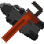

  

<h1 style="text-align: center;">GalacticraftCompatibility</h1>

  
  

  <a href="#English">English</a> | <a href="#中文">中文</a>

---

## English

GalacticraftCompatibility (GCC) is a Minecraft Forge mod for **1.12.2** that resolves compatibility issues between Galacticraft addons by automatically modifying configuration files.

When you launch the game for the first time with GCC installed, a configuration wizard will guide you through selecting compatible options for your addon setup. Once configured, the settings are saved and applied on the next restart.

### Features

- **Automatic Compatibility Resolution** — Fixes conflicts between GalaxySpace, ExtraPlanets, AsmodeusCore, The Sol, and other addons.
- **First-Launch Configuration Wizard** — A user-friendly GUI prompts you on first launch to select your preferred galaxy map, space station implementation, and duplicate planet handling.
- **Server-Client Config Validation** — Prevents players from joining if their client configuration does not match the server, with a detailed mismatch report.
- **Duplicate Planet Management** — Automatically disables overlapping planets between GalaxySpace and ExtraPlanets to prevent ID conflicts.
- **Galaxy Map Selection** — Choose between Galacticraft, AsmodeusCore, ExtraPlanets, or The Sol galaxy maps.
- **Space Station Selection** — Choose between GalaxySpace or ExtraPlanets space stations.
- **Additional Tweaks** — Optional controls for AsmodeusCore shaders, GalaxySpace's new main menu, and advanced rocket crafting recipes.
- **Exoplanets Warning Suppression** — Automatically disables the beta build warning for Interstellar: Exoplanets.

### Supported Mods

GalaxySpace, AsmodeusCore, ExtraPlanets and TheSol.

---

## 中文

GalacticraftCompatibility（简称 GCC）是一个适用于 **Minecraft 1.12.2 Forge** 的模组，用于自动解决 Galacticraft 星系附属模组之间的兼容性问题。

首次安装 GCC 后启动游戏时，会弹出一个配置向导界面，引导你根据已安装的附属模组选择合适的兼容选项。配置完成后，设置会被保存并在下次启动时生效。

### 主要功能

- **自动兼容性修复** — 解决星空、额外行星、AsmodeusCore、太阳系等附属模组之间的冲突。
- **首次启动配置向导** — 友好的图形界面在首次启动时引导你选择星图、空间站和重复星球处理方式。
- **服务端-客户端配置校验** — 如果客户端配置与服务端不匹配，将阻止玩家进入服务器并显示详细的差异报告。
- **重复星球管理** — 自动禁用星空与额外行星之间重叠的星球，防止 ID 冲突。
- **星图选择** — 支持在星系、AsmodeusCore、额外行星和太阳系的星图之间切换。
- **空间站选择** — 支持在星空与额外行星的空间站实现之间切换。
- **附加调整** — 可选启用 AsmodeusCore 光影、星空新主菜单和高级火箭合成配方。
- **关闭 Exoplanets 警告** — 自动禁用星际：系外行星的测试版本提示。

### 支持的模组

星空、 AsmodeusCore、额外行星、太阳系。